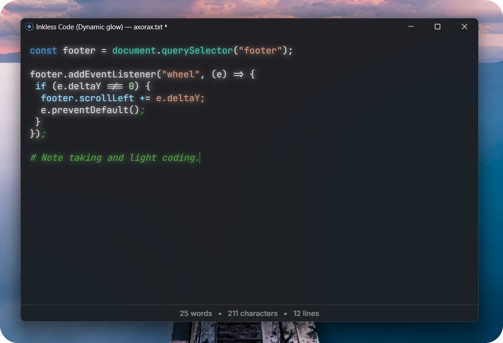

<p align="center">
    
</p>

<p align="center">
    <b>Inkless</b>
</p>

<p align="center">
    Write simple, stay focused.
</p>

## ❓ About

Inkless is a minimal, lightweight (less than 4 MB), shortcut-based text editor. You can use it for writing notes or coding (CTRL + SHIFT + C). Anything you paste is automatically converted to plain text.

If you write and close the app without saving, it won't nag you to save before closing. This is intentionally done to make it easier to create session notes. There will be a `*` symbol beside the filename in the titlebar if you have unsaved changes. And, if code mode or dynamic glow is enabled, it will mention that in the titlebar.

Inkless also supports extensions. Settings and extensions are stored in a file called `data.inkfmt` (located in same directory as executable). Extensions are written in JavaScript and have full access to all web features. To add an extension, add this to the file:

```
ext.EXTENSION_NAME = ---
console.log("Hello world");
---
```

Example data file with settings and extensions:

```
theme = mica
code_mode = true
glow = true

ext.consolelog = ---
console.log("hello!");
---

ext.anotherone = ---
if (5 > 4) {
    alert("5 is greater than 4.");
}
---
```

Donations are really appreciated and would help in the improvement of the project! https://www.patreon.com/axorax

<br>

<p align="center">
    
</p>

<br>

> [!NOTE]
> If the status bar (the bottom area that has word count, line count, etc.) overflows and you cannot see the rest of the content, then, you can scroll to go sideways.

## 🎹 Keyboard shortcuts

For macOS, use the meta key instead of `CTRL`.

| Shortcut         | Description                                                       |
| ---------------- | ----------------------------------------------------------------- |
| CTRL + O         | Open document                                                     |
| CTRL + S         | Save document                                                     |
| CTRL + M         | Toggle Mica effect (Windows only)                                 |
| CTRL + T         | Switch between themes                                             |
| CTRL + W         | Toggle status bar visibility                                      |
| CTRL + F         | Find and search tool                                              |
| CTRL + G         | Toggle grid                                                       |
| CTRL + E         | Toggle spellchecker                                               |
| CTRL + P         | Open print menu                                                   |
| CTRL + R         | Reload app                                                        |
| CTRL + N         | Toggle glow                                                       |
| CTRL + SHIFT + N | Toggle dynamic glow (Takes more processing power, code mode only) |
| CTRL + Scroll    | Increase or decrease font size                                    |
| CTRL + SHIFT + C | Toggle code mode                                                  |

## ⌨️ Editor shortcuts

You can use these shortcuts while writing in the input field. For macOS, use the meta key instead of `CTRL`. Effects like bold, italic and so on don't get saved. So, if you reload or load the file after saving, they won't appear.

| Shortcut         | Description                                           |
| ---------------- | ----------------------------------------------------- |
| ", ', (, {, [, < | Automatically closes it and puts cursor in the middle |
| Tab              | Indent with four spaces                               |
| CTRL + X         | Copy and delete line                                  |
| Home             | Go to start of line                                   |
| End              | Go to end of line                                     |
| Delete           | Remove character infront of cursor                    |
| CTRL + B         | Bold text                                             |
| CTRL + I         | Italic text                                           |
| CTRL + U         | Underline text                                        |
| CTRL + K         | Strikethrough text                                    |

## 💻 Supported programming languages

| Language      | Language       | Language   | Language     | Language   | Language      | Language   |
| ------------- | -------------- | ---------- | ------------ | ---------- | ------------- | ---------- |
| 1c            | abnf           | accesslog  | actionscript | ada        | angelscript   | apache     |
| applescript   | arcade         | arduino    | armasm       | xml        | asciidoc      | aspectj    |
| autohotkey    | autoit         | avrasm     | awk          | axapta     | bash          | basic      |
| bnf           | brainfuck      | c          | cal          | capnproto  | ceylon        | clean      |
| clojure       | clojure-repl   | cmake      | coffeescript | coq        | cos           | cpp        |
| crmsh         | crystal        | csharp     | csp          | css        | d             | markdown   |
| dart          | delphi         | diff       | django       | dns        | dockerfile    | dos        |
| dsconfig      | dts            | dust       | ebnf         | elixir     | elm           | ruby       |
| erb           | erlang-repl    | erlang     | excel        | fix        | flix          | fortran    |
| fsharp        | gams           | gauss      | gcode        | gherkin    | glsl          | gml        |
| go            | golo           | gradle     | graphql      | groovy     | haml          | handlebars |
| haskell       | haxe           | hsp        | http         | hy         | inform7       | ini        |
| irpf90        | isbl           | java       | javascript   | jboss-cli  | json          | julia      |
| julia-repl    | kotlin         | lasso      | latex        | ldif       | leaf          | less       |
| lisp          | livecodeserver | livescript | llvm         | lsl        | lua           | makefile   |
| mathematica   | matlab         | maxima     | mel          | mercury    | mipsasm       | mizar      |
| perl          | mojolicious    | monkey     | moonscript   | n1ql       | nestedtext    | nginx      |
| nim           | nix            | node-repl  | nsis         | objectivec | ocaml         | openscad   |
| oxygene       | parser3        | pf         | pgsql        | php        | php-template  | plaintext  |
| pony          | powershell     | processing | profile      | prolog     | properties    | protobuf   |
| puppet        | purebasic      | python     | python-repl  | q          | qml           | r          |
| reasonml      | rib            | roboconf   | routeros     | rsl        | ruleslanguage | rust       |
| sas           | scala          | scheme     | scilab       | scss       | shell         | smali      |
| smalltalk     | sml            | sqf        | sql          | stan       | stata         | step21     |
| stylus        | subunit        | swift      | taggerscript | yaml       | tap           | tcl        |
| thrift        | tp             | twig       | typescript   | vala       | vbnet         | vbscript   |
| vbscript-html | verilog        | vhdl       | vim          | wasm       | wren          | x86asm     |
| xl            | xquery         | zephir     |              |            |               |            |

---

<p align="center">
    <a href="https://github.com/Axorax/socials">Socials + Donate</a>
</p>
